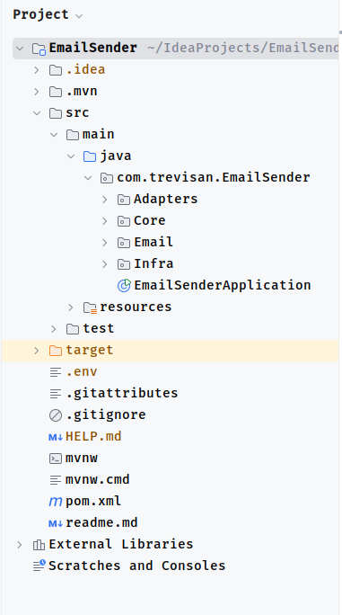

# 🚀 Email Sender Application 📧

Welcome to the **Email Sender Application**! This Spring Boot app makes sending emails via Amazon SES a breeze. 🌟 Whether you're notifying users or blasting newsletters, we've got you covered with a simple API. Let's dive in! 🎉

## 📋 Overview

This is a Spring Boot application designed to send emails using Amazon Simple Email Service (SES). It provides a REST API endpoint to trigger email sending with customizable subject and recipient. The application uses AWS SDK for Java to integrate with SES and includes basic HTML email templates. 💌

The core functionality revolves around sending professional emails with HTML content, handling errors, and configuring AWS credentials securely. 🔒

## ✨ Features

- **REST API for Email Sending** 📬: Expose a POST endpoint to send emails with recipient and subject.
- **AWS SES Integration** ☁️: Uses AWS SES for reliable email delivery.
- **HTML Email Templates** 🎨: Predefined HTML templates for email body, including placeholders for personalization.
- **Error Handling** ⚠️: Custom API error response model.
- **DTO and Use Case Abstractions** 🛠️: Clean architecture with interfaces for email sending gateway and use cases.
- **Configuration Management** ⚙️: Environment-based configuration for AWS credentials and region.

## 🛡️ Technologies Used

- **Java** ☕: Core programming language.
- **Spring Boot** 🌱: Framework for building the application (version inferred from dependencies).
- **AWS SDK for Java** 📦: For SES client integration (software.amazon.awssdk.services.ses).
- **Lombok** 🧰: For reducing boilerplate code (e.g., @Data, @AllArgsConstructor).
- **Other Libraries** 📚: Implicitly includes Spring Web for REST controllers.

## 🗂️ Project Structure

The application follows a modular structure with packages for core logic, adapters, infrastructure, and exceptions:

- **com.trevisan.EmailSender** 📁: Main application package.
    - **Adapters** 🔌: Interfaces like `EmailSenderGateway`.
    - **Core** 💡:
        - **Dtos** 📝: Data Transfer Objects like `EmailSenderDto`.
        - **Exceptions** 🚨: Error handling like `ApiError`.
        - **UseCases** 🏗️: Interfaces like `EmailSenderUseCase`.
    - **Email** ✉️: Template classes like `index.html`.
    - **Infra** 🏗️:
        - **Controllers** 🎮: REST controllers like `SesController`.
        - **Services** 🛎️: Implementations like `SesService`.
        - **Config** 🔧: Configurations like `SesConfig`.

Key Files:
- `EmailSenderApplication.java` 🚀: Entry point for the Spring Boot application.
- `EmailSenderGateway.java` 🔗: Interface defining the email sending contract.
- `EmailSenderDto.java` 📄: Record for email input (to, subject).
- `ApiError.java` ❌: Model for API error responses.
- `EmailSenderUseCase.java` 🔄: Interface for business logic of email sending.
- `EmailTemplates.java` 🖼️: Component providing HTML email body templates.
- `index.html` 🌐: Standalone HTML template (mirrors the content in `Email` for reference or testing).
- `SesService.java` 📧: SES implementation of the email gateway.
- `SesController.java` 🕹️: Controller handling the `/api/v1/sendEmail/send` endpoint.
- `SesConfig.java` ⚙️: Bean configuration for SES client using environment variables.

## 🛠️ Setup and Installation

### Prerequisites

- Java 17+ (compatible with Spring Boot). ☕
- Maven (for building the project, assuming standard Spring Boot setup). 🏗️
- AWS Account with SES configured (verified sender email and production access if needed). ☁️
- Environment variables for AWS credentials:
    - `ACCESS_KEY` 🔑: AWS Access Key ID.
    - `SECRET_KEY` 🔒: AWS Secret Access Key.
    - `REGION` 🌍: AWS Region (e.g., `us-east-1`).

### Steps

1. **Clone the Repository** 📥:
   ```
   git clone https://github.com/ThiagoST32/Spring-Boot-Email-Sender.git
   cd email-sender-application
   ```

2. **Configure Environment Variables** ⚙️:
   Set the required AWS credentials in your environment or via a `ConfigEnv` bean (injected in `SesConfig`), you will need to create a .env file to place your access credentials, following the standard configuration `ConfigEnv` file responsible for reading this information.
   

3. **Build the Project** 🛠️:
   ```
   mvn clean install
   ```

4. **Run the Application** 🚀:
   ```
   mvn spring-boot:run
   ```
   Or run directly from `EmailSenderApplication.java` in your IDE.

The application will start on the default port (8080) unless configured otherwise. 🎊

## 🔧 Configuration

- **AWS SES Client** ☁️: Configured in `SesConfig.java` using `ConfigEnv` for credentials and region.
- **Email** 🎨: Defined in `Email/` with a hardcoded HTML body. Customize `bodyHtml` as needed.
- **Sender Email** 📤: Currently set to the recipient (`to`) in `sendEmailRequest`, which might be a placeholder. Update to a verified sender email in production.

Note: Ensure your AWS SES is out of sandbox mode for sending to unverified emails. 🏖️

## 📖 Usage

### API Endpoints

- **Send Email** 📩:
    - **Method**: POST
    - **URL**: `/api/v1/sendEmail/send`
    - **Request Body**: JSON with `to` (recipient email) and `subject` (email subject).
      Example:
      ```json
      {
        "to": "recipient@example.com",
        "subject": "Welcome Email"
      }
      ```
    - **Export the file**: EmailSender.postman_collection on your postman.
    - **Response**:
        - Success: 200 OK with message "Email enviado!". ✅
        - Error: Custom `ApiError` response with status code, message, and timestamp. ❌

### Example Request (using curl) 🌀

```
curl -X POST http://localhost:8080/api/v1/sendEmail/send \
-H "Content-Type: application/json" \
-d '{"to": "recipient@example.com", "subject": "Test Subject"}'
```

## ✉️ Email Content

The email body uses a predefined HTML template from `Email/index.html`, which includes:
- Greeting (e.g., "Olá, Thiago Trevisan"). 👋
- Professional message. 💼
- Call-to-action button. 🔘
- Footer with sender info and unsubscribe link. 📌

For customization, modify the template string or extend `EmailTemplates`. 🎨

## 🚨 Error Handling

Errors are wrapped in `ApiError` objects, including HTTP status, message, and timestamp. Handle exceptions in controllers or services as needed. 🛑

## ⚠️ Limitations

- Hardcoded template: Personalization is limited; consider dynamic templating for production. 📝
- No attachments or advanced features: Basic text/HTML body only. 📎
- Security: Ensure credentials are not hardcoded; use secrets management. 🔐
- Testing: Add unit/integration tests for services and controllers. 🧪

## 🤝 Contributing

Contributions are welcome! Please fork the repository and submit pull requests for improvements, bug fixes, or new features. 🌟